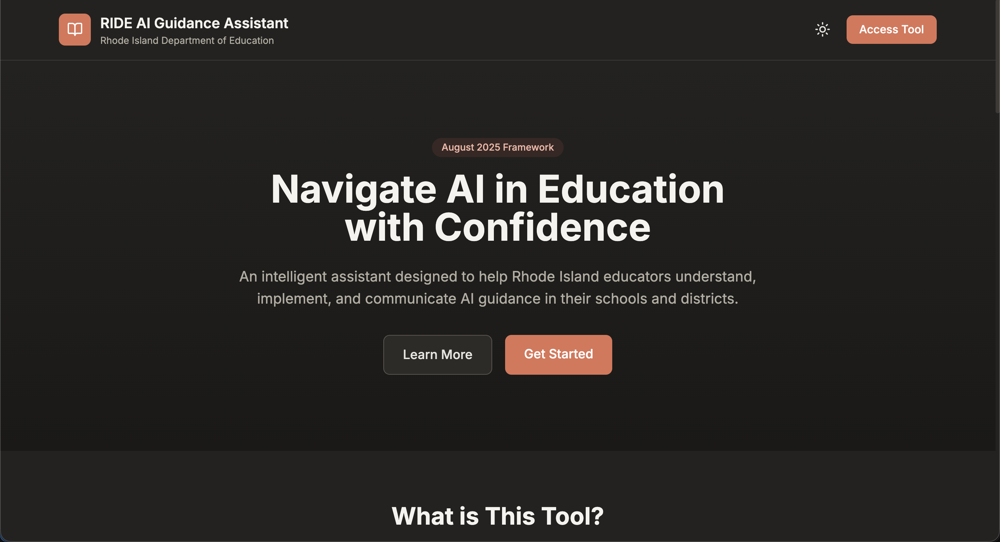
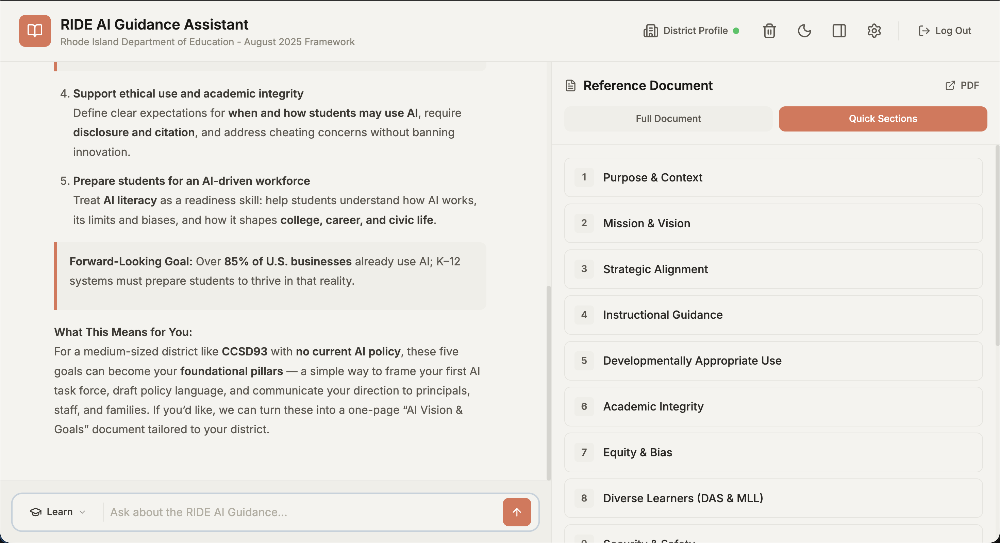
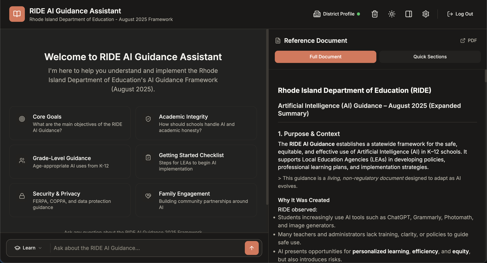
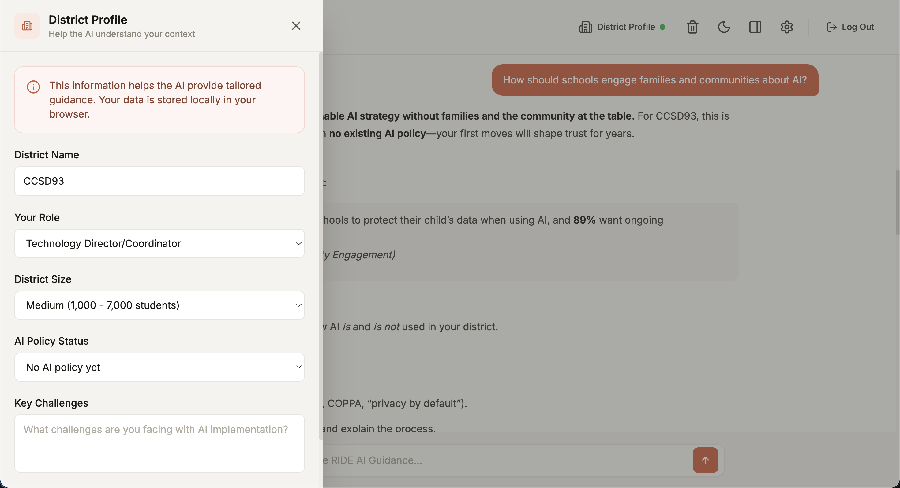

# RIDE AI Guidance Assistant

An AI-powered web application designed to help Rhode Island educators understand and implement the Rhode Island Department of Education's (RIDE) AI Guidance Framework (August 2025).

## Overview

The RIDE AI Guidance Assistant is an intelligent chatbot that helps K-12 educators, administrators, and policy makers navigate AI implementation in their schools and districts. It provides instant answers, policy drafting assistance, and personalized guidance based on the official RIDE framework.

## Screenshots

### Welcome Screen

*The welcome screen with suggested questions to get started*

### Chat Interface - Learn Mode

*Learn Mode provides educational, narrative-driven explanations*

### Knowledge Base Sidebar

*Full RIDE guidance document available in the sidebar*

### Dark Mode

*Full dark mode support for comfortable viewing*

## Features

### Dual Conversation Modes
- **Learn Mode** - Educational, narrative-driven explanations for understanding the RIDE guidance
- **Build Mode** - Implementation-focused assistance for creating policies and action plans

### Core Functionality
- Real-time streaming responses powered by OpenAI GPT-5.1
- Stop/cancel button to interrupt responses at any time
- District profile system for personalized recommendations
- Knowledge base sidebar with full RIDE guidance document
- Dark/light mode theming
- Mobile-responsive design

### Security Features
- Password protection with bcrypt hashing
- CSRF token validation
- Secure session configuration (HttpOnly, SameSite, Secure cookies)
- Rate limiting (configurable requests per time window)
- Session fixation protection

## Tech Stack

| Component | Technology |
|-----------|------------|
| Backend | PHP 7.4+ |
| Frontend | HTML5, Tailwind CSS, Vanilla JavaScript |
| AI | OpenAI GPT-5.1 (Responses API) |
| Icons | Lucide Icons |
| Markdown | Marked.js |
| Server | Apache (XAMPP) |

## Project Structure

```
ride/
├── index.php                 # Landing page with login
├── README.md                 # This file
└── v2/
    ├── index.php             # Main chat application
    ├── api.php               # OpenAI API endpoint
    ├── config.php            # Configuration and system prompts
    ├── logout.php            # Session termination
    ├── .env                  # Environment variables (API keys, passwords)
    ├── .htaccess             # Apache security configuration
    ├── knowledge-base.md     # RIDE AI Guidance document
    └── RIDE.pdf              # Original RIDE PDF reference
```

## Installation

### Prerequisites
- PHP 7.4 or higher
- Apache web server (XAMPP, MAMP, or similar)
- OpenAI API key with access to GPT-5.1

### Setup Steps

1. **Clone or copy the project** to your web server directory:
   ```bash
   # For XAMPP on macOS
   cp -r ride /Applications/XAMPP/xamppfiles/htdocs/

   # For XAMPP on Windows
   # Copy to C:\xampp\htdocs\
   ```

2. **Configure the environment file** at `v2/.env`:
   ```env
   # OpenAI API Key
   OPENAI_API_KEY=sk-your-api-key-here

   # Access Password (bcrypt hash)
   # Generate with: php -r "echo password_hash('YourPassword', PASSWORD_BCRYPT);"
   ACCESS_PASSWORD_HASH=$2y$12$your-hash-here

   # Rate Limiting
   RATE_LIMIT_REQUESTS=20
   RATE_LIMIT_WINDOW=60
   ```

3. **Generate a password hash**:
   ```bash
   php -r "echo password_hash('YourSecurePassword', PASSWORD_BCRYPT);"
   ```
   Copy the output to `ACCESS_PASSWORD_HASH` in `.env`

4. **Start your web server** and navigate to:
   ```
   http://localhost/ride/
   ```

## Configuration

### Environment Variables (v2/.env)

| Variable | Description | Default |
|----------|-------------|---------|
| `OPENAI_API_KEY` | Your OpenAI API key | Required |
| `ACCESS_PASSWORD_HASH` | Bcrypt hash of the access password | Required |
| `RATE_LIMIT_REQUESTS` | Max API requests per window | 20 |
| `RATE_LIMIT_WINDOW` | Rate limit window in seconds | 60 |

### OpenAI Settings (v2/config.php)

| Setting | Learn Mode | Build Mode |
|---------|------------|------------|
| Model | GPT-5.1 | GPT-5.1 |
| Reasoning Effort | none | medium |
| Temperature | 0.7 | N/A |
| Top P | 0.9 | N/A |
| Verbosity | low | medium |

## Usage

### For Educators

1. **Log in** with the access password
2. **Set your district profile** (optional but recommended) - Click the profile icon to enter your district name, role, and challenges
3. **Choose a mode**:
   - Use **Learn Mode** to understand the RIDE guidance
   - Use **Build Mode** to create policies and plans
4. **Ask questions** or use the suggested prompts
5. **Reference the sidebar** to browse the full RIDE document

### Example Questions

**Learn Mode:**
- "What are the core goals of the RIDE AI Guidance?"
- "How should AI be used differently in elementary vs. high school?"
- "What are the FERPA implications of using AI tools?"

**Build Mode:**
- "Help me draft an AI acceptable use policy for my district"
- "Create a parent communication letter about AI in the classroom"
- "Develop a professional development plan for AI literacy"

## Customization

### Changing the Password

```bash
# Generate a new hash
php -r "echo password_hash('NewPassword', PASSWORD_BCRYPT);"

# Update v2/.env with the new hash
ACCESS_PASSWORD_HASH=$2y$12$new-hash-here
```

### Adjusting Font Size

Edit the `html { font-size: 17px; }` value in:
- `index.php` (two locations)
- `v2/index.php`

### Modifying System Prompts

Edit `v2/config.php` to customize:
- `SYSTEM_PROMPT` - Base AI behavior
- `LEARN_MODE_PROMPT` - Learn mode specific instructions
- `BUILD_MODE_PROMPT` - Build mode specific instructions

### Updating the Knowledge Base

Replace or edit `v2/knowledge-base.md` with updated RIDE guidance content.

## Security Considerations

### Production Deployment

For production environments, ensure:

1. **HTTPS is enabled** - Session cookies are configured to be secure when HTTPS is detected
2. **File permissions** - Restrict access to `.env` file
3. **Error logging** - Errors are logged, not displayed
4. **Rate limiting** - Adjust limits based on expected usage

### Protected Files

The `.htaccess` file blocks direct access to:
- `.env` files
- Other sensitive configuration

## API Endpoints

### POST /v2/api.php

Send a message to the AI assistant.

**Request Body:**
```json
{
  "message": "Your question here",
  "mode": "learn",
  "history": [],
  "stream": true,
  "districtContext": "Optional district profile"
}
```

**Response (Streaming):**
```
data: {"content": "Partial response..."}
data: {"content": "More content..."}
data: [DONE]
```

**Error Response:**
```json
{
  "error": "Error message"
}
```

## Troubleshooting

### "Security configuration error" on login
- Ensure `ACCESS_PASSWORD_HASH` is set in `v2/.env`
- Check that the `.env` file exists and is readable

### "OpenAI API key not configured"
- Add your API key to `v2/.env`
- Verify the key has access to the GPT-5.1 model

### Rate limit errors
- Wait for the specified time before retrying
- Adjust `RATE_LIMIT_REQUESTS` and `RATE_LIMIT_WINDOW` in `.env`

### Streaming not working
- Check that `ENABLE_STREAMING` is `true` in `config.php`
- Verify your server supports Server-Sent Events (SSE)
- Check `.htaccess` for output buffering settings

## License

This is an educational tool and is not an official RIDE product. Based on the Rhode Island Department of Education AI Guidance Framework (August 2025).

## Support

For issues or questions about this tool, contact your district technology coordinator or the tool administrator.

---

*Built with OpenAI GPT-5.1 and designed for Rhode Island educators.*
